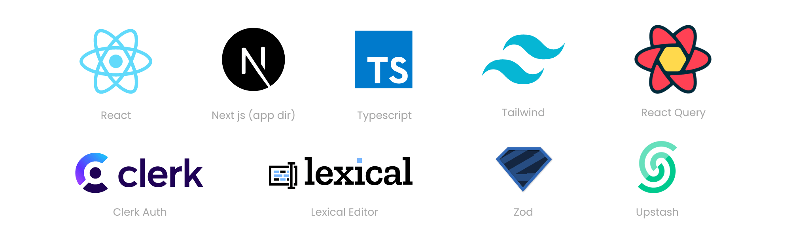
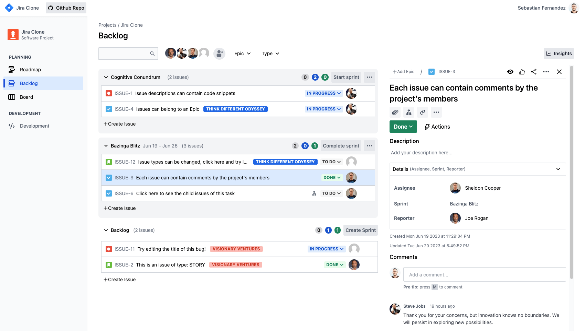

<h1 align="center">Jira Clone built with React and Next.js 13 (app dir)</h1>

## Features

- Written in modern React
- Uses Next js 13.4 app directory structure
- Explores basic React Server Components
- Full user authentication lifecycle with Clerk
- Rate limiting with upstash to avoid spamming
- Modern data fetching using React-Query
- Simple local React state management, without redux, mobx, or similar
- Uses Radix UI library for unstyled components and Tailwind for styling
- Uses Prisma ORM for database modeling
- Entire app written with typescript
- End to end type safety with Zod

## Setting up development environment

- Project uses Prisma, you can decide which database to use. \*By default it uses the 'mysql' provider
- `git clone https://github.com/sebastianfdz/jira_clone`
- Create an empty `.env` file inside the root dir `/`, copy `/.env.example` contents into it, and fill in the variables needed.
- `npm install`
- `npx prisma db seed`
- Lookup 'USE THIS IF RUNNING LOCALLY' inside the project and follow the instructions.
- `npm run dev`
- App should now be running on `http://localhost:3000/`

## What's Pending?

There are features pending from this showcase product which should exist in a real product:

### Unit/Integration tests

Unit and integration tests are currently in progress... The app will be using [Vitest](https://vitest.dev/) and [React Testing Library](https://testing-library.com/docs/react-testing-library/intro/).

### End to end tests

End to end tests are currently in progress as well... The app will be using [Cypress](https://www.cypress.io/).

## Contributing

Contributions to this project are welcome. Feel free to submit bug reports, feature requests, or pull requests to help improve the app.

## Acknowledgements

- Inspired by @oldboyxx's https://github.com/oldboyxx/jira_clone
- App was initially bootstrapped with T3's [create-t3-app](https://create.t3.gg/)

## License

This project is licensed under the [MIT](https://opensource.org/licenses/MIT) license.

